# Architecture — agent-server

---

## Table of Contents

1. [System Overview](#1-system-overview)
2. [Component Architecture](#2-component-architecture)
3. [Request Lifecycle](#3-request-lifecycle)
4. [Agent Routing Logic](#4-agent-routing-logic)
5. [File Upload & RAG Pipeline](#5-file-upload--rag-pipeline)
6. [MCP Tool Integration](#6-mcp-tool-integration)
7. [LangGraph State Machines](#7-langgraph-state-machines)
8. [Database Design](#8-database-design)
9. [Security Model](#9-security-model)
10. [Infrastructure](#10-infrastructure)
11. [Layer Responsibilities](#11-layer-responsibilities)

---

## 1. System Overview

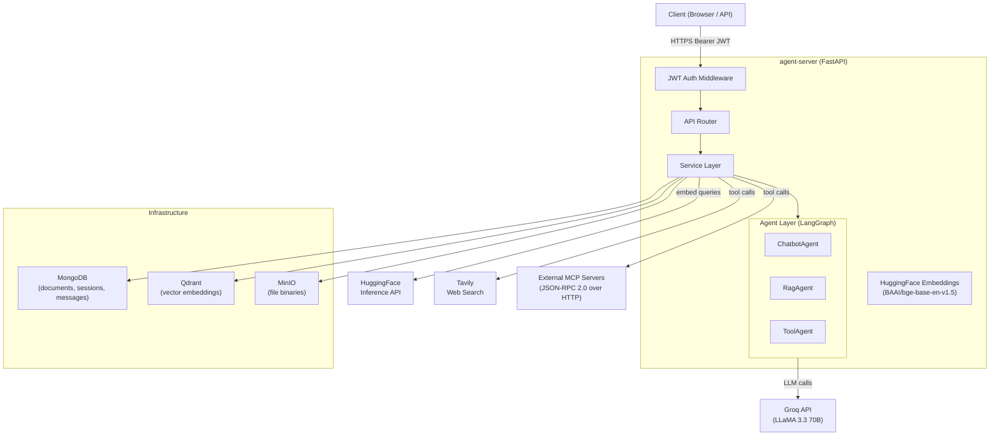

---

## 2. Component Architecture

```mermaid
graph LR
    subgraph Routers ["Routers (HTTP only)"]
        R_Auth["auth.py"]
        R_Sessions["sessions.py"]
        R_Chat["chat.py"]
        R_Files["files.py"]
        R_MCP["mcp.py"]
        R_Users["users.py"]
        R_Health["health.py"]
    end

    subgraph Services ["Services (Business Logic)"]
        AuthSvc["AuthService"]
        SessionSvc["SessionService"]
        ChatSvc["ChatService"]
        FileSvc["FileService"]
        VectorSvc["VectorService"]
        MCPSvc["MCPService"]
        ToolSvc["ToolService"]
    end

    subgraph AgentLayer ["Agents + Graphs"]
        BaseAgent["BaseAgent (ABC)"]
        ChatbotAgent["ChatbotAgent"]
        RagAgent["RagAgent"]
        ToolAgent["ToolAgent"]
        ChatbotGraph["chatbot_graph\nSTART → llm_node → END"]
        RagGraph["rag_graph\nSTART → retrieve → generate → END"]
        ToolGraph["tool_graph\nReAct (prebuilt)"]
    end

    subgraph Repos ["Repositories (Data Access)"]
        UserRepo["UserRepository"]
        SessionRepo["SessionRepository"]
        MessageRepo["MessageRepository"]
        FileRepo["FileRepository"]
        ChunkRepo["ChunkRepository"]
        MCPRepo["MCPRepository"]
        QdrantRepo["QdrantRepository"]
    end

    subgraph DBClients ["DB Clients (Singletons)"]
        MongoClient["Motor AsyncIOMotorClient\napp/db/mongo.py"]
        QdrantClient["AsyncQdrantClient\napp/db/qdrant.py"]
        MinioClient["Minio Client\napp/storage/minio.py"]
    end

    Routers --> Services
    Services --> AgentLayer
    Services --> Repos
    AgentLayer --> BaseAgent
    BaseAgent --> ChatbotAgent & RagAgent & ToolAgent
    ChatbotAgent --> ChatbotGraph
    RagAgent --> RagGraph
    ToolAgent --> ToolGraph
    Repos --> DBClients
```

---

## 3. Request Lifecycle

### Blocking Chat Request

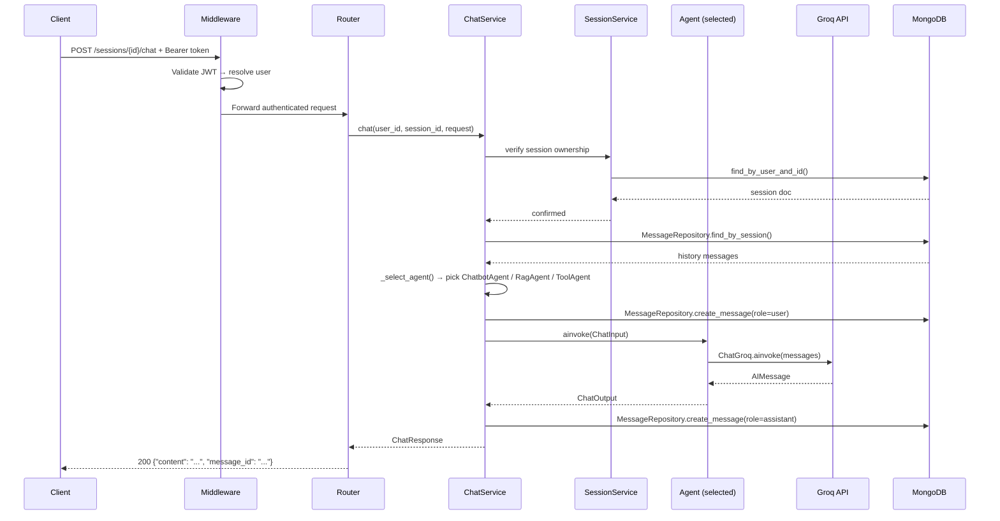

### SSE Streaming Request

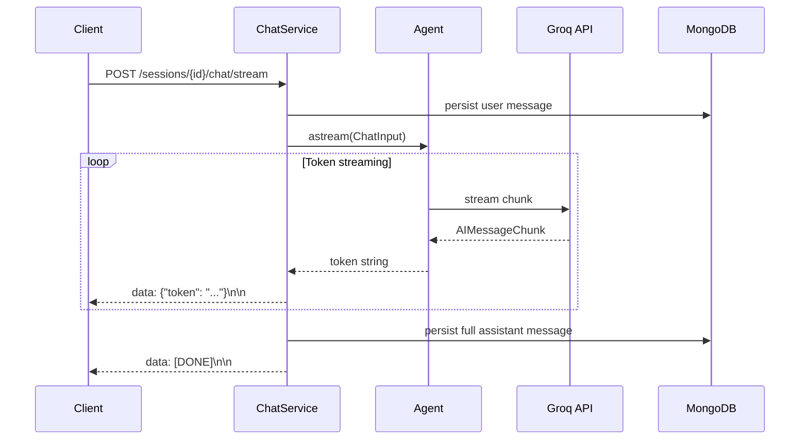

---

## 4. Agent Routing Logic

`ChatService._select_agent()` automatically picks the right agent based on request context:

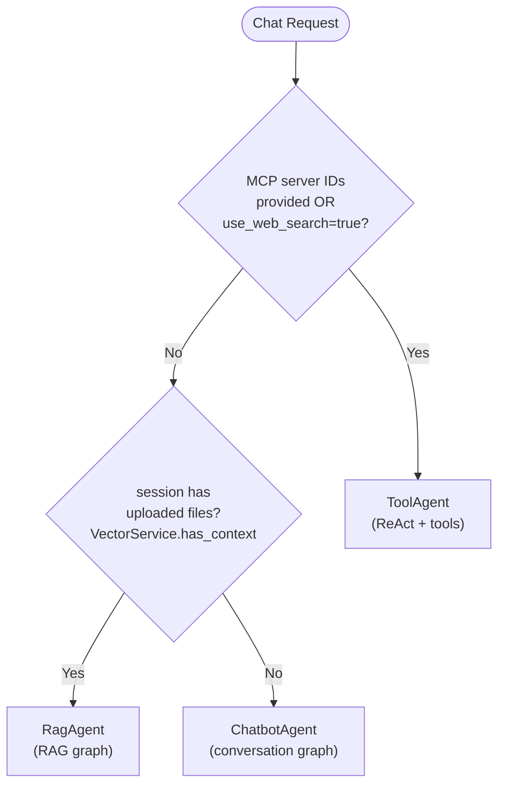

Priority: **Tool > RAG > Chatbot**

---

## 5. File Upload & RAG Pipeline

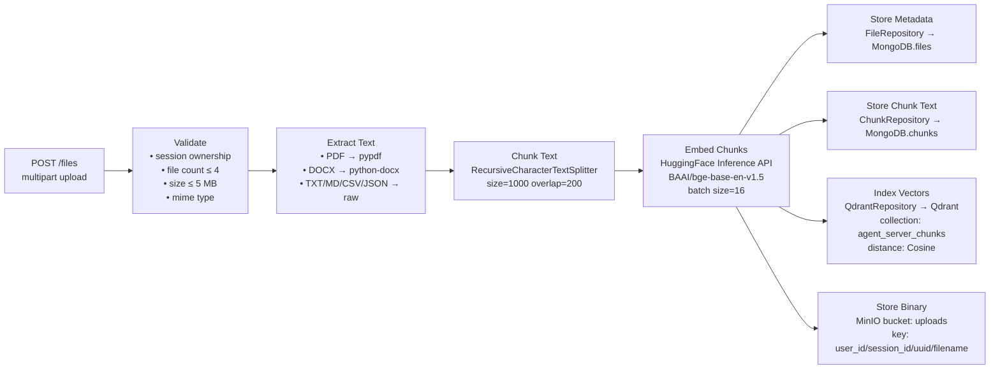

### RAG Retrieval (at chat time)

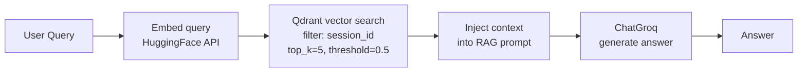

---

## 6. MCP Tool Integration

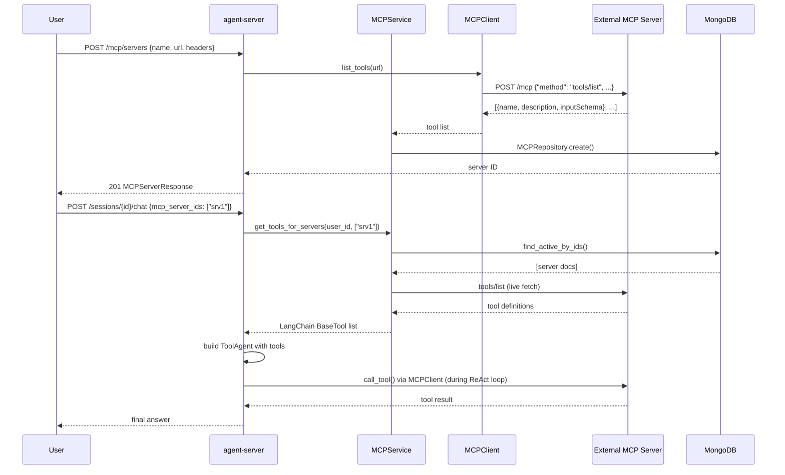

---

## 7. LangGraph State Machines

### Chatbot Graph

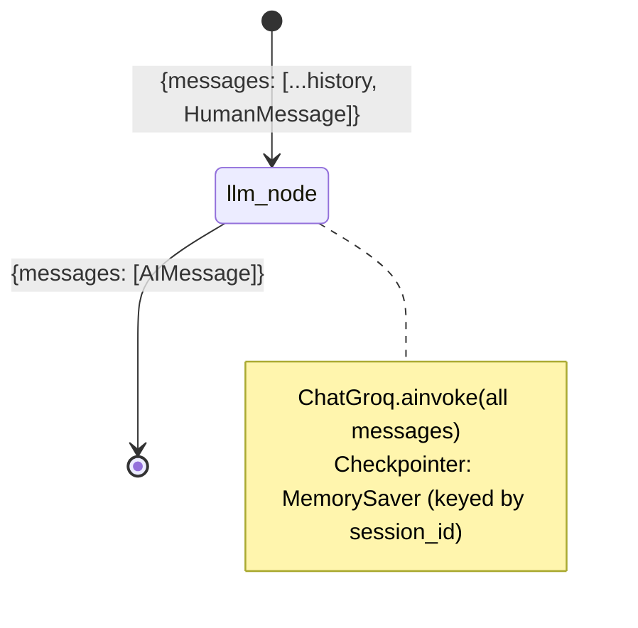

### RAG Graph

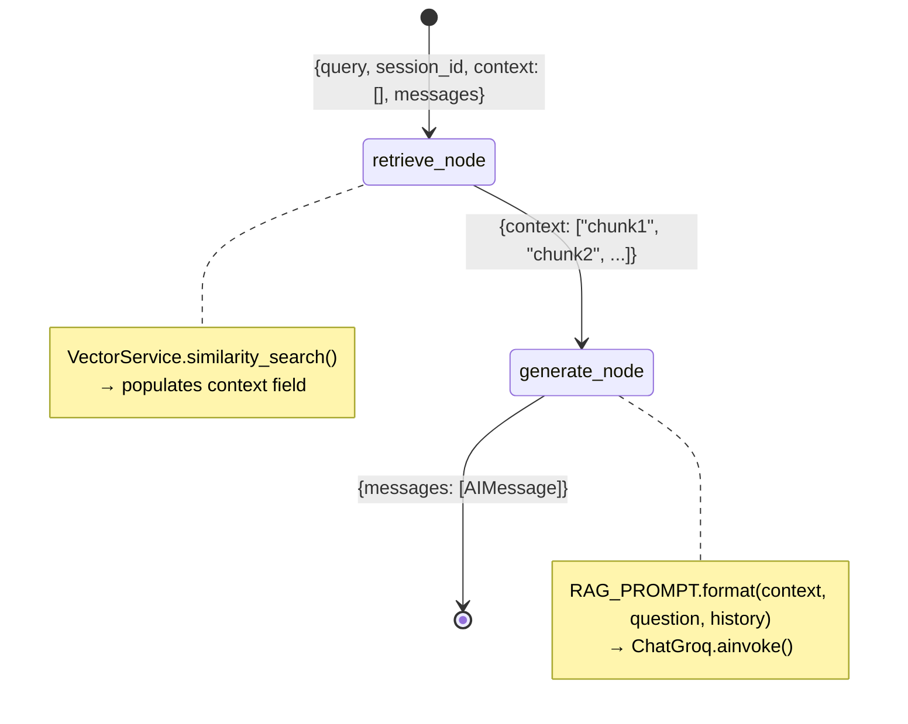

### Tool Graph (ReAct)

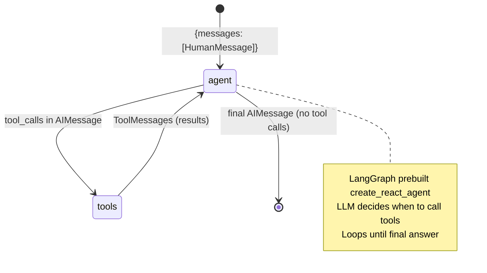

---

## 8. Database Design

### MongoDB Collections

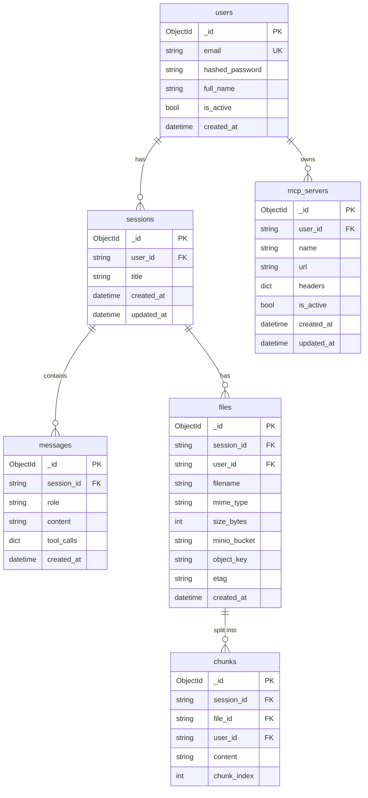

### Qdrant Collection (`agent_server_chunks`)

| Field | Type | Description |
|---|---|---|
| vector | float\[768\] | BAAI/bge-base-en-v1.5 embedding, Cosine distance |
| `session_id` | string (payload) | Used for filtered search |
| `file_id` | string (payload) | Used for deletion by file |
| `user_id` | string (payload) | Owner reference |
| `content` | string (payload) | Raw chunk text returned to LLM |
| `chunk_index` | int (payload) | Position within original file |

### MinIO Bucket (`uploads`)

Object key pattern: `{user_id}/{session_id}/{uuid4}/{original_filename}`

---

## 9. Security Model

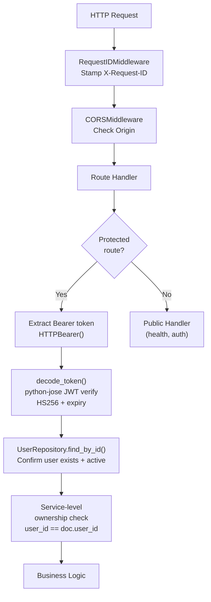

**Key security properties:**

- Passwords hashed with **bcrypt** (passlib), never stored in plaintext
- JWTs signed with **HS256**, configurable expiry (default 60 min)
- **Ownership enforced** at the service layer for every session/file/MCP operation — no row-level security, explicit `user_id` checks
- File uploads validated: MIME type, size limit (default 5 MB), file count per session (max 4)
- Rate limiting on chat endpoints: 30 requests / minute (SlowAPI)
- CORS origins explicitly configured via `CORS_ORIGINS` env var
- MCP server connectivity verified **before** persisting to database

---

## 10. Infrastructure

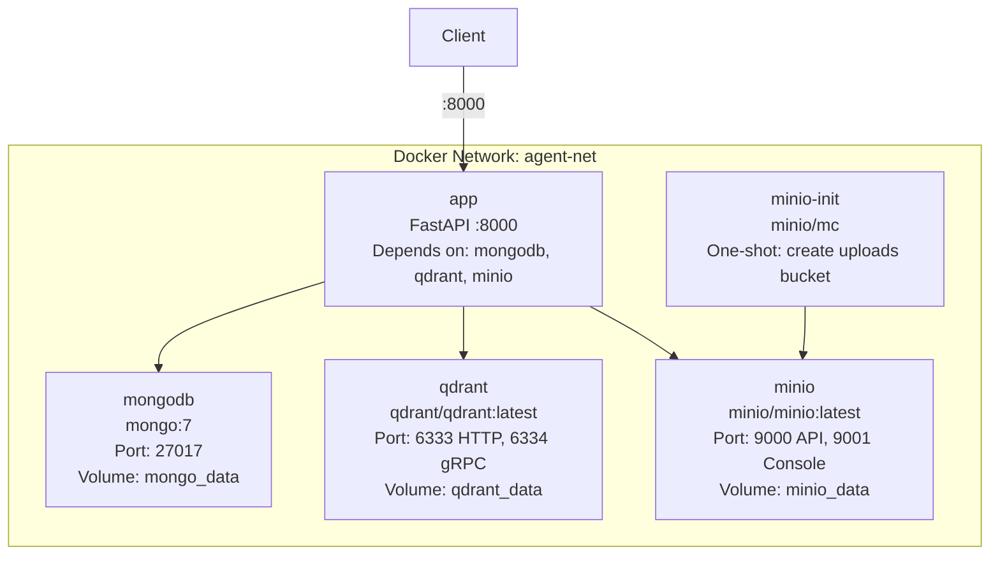

**Health checks:** All data services (`mongodb`, `qdrant`, `minio`) have Docker health checks. The `app` service waits for all three to be healthy before starting.

**Startup sequence in `app/main.py` lifespan:**
1. Ping MongoDB: `admin.command("ping")`
2. Ping Qdrant: `get_collections()`
3. Skip both when `APP_ENV=test`

**Shutdown sequence:**
1. `close_client()` — MongoDB Motor client
2. `close_client()` — Qdrant async client

---

## 11. Layer Responsibilities

| Layer | Location | Responsibility | Forbidden |
|---|---|---|---|
| **Routers** | `app/routers/` | HTTP request/response, status codes, DI injection | Business logic, DB calls |
| **Services** | `app/services/` | Business logic, orchestration, ownership checks | Direct DB/Motor calls |
| **Repositories** | `app/repositories/` | All MongoDB and Qdrant I/O | Business logic |
| **Agents** | `app/agents/` | LangGraph invocation, streaming | Direct DB calls |
| **Graphs** | `app/graphs/` | LangGraph state machine definitions | Side effects outside state |
| **DB clients** | `app/db/` | Motor and Qdrant singleton clients | Business logic |
| **Storage** | `app/storage/` | MinIO singleton client | Business logic |
| **Models** | `app/models/` | Pydantic schemas for API I/O | Logic |
| **Utils** | `app/utils/` | LLM factory, embedder factory, JWT helpers | Stateful operations |

### Dependency Rule

```
Routers → Services → Repositories → DB Clients
              ↓
           Agents → Graphs → LLM (Groq)
              ↓
           Tools → MCPClient / TavilySearch
```

No layer may import from a layer above it. Repositories are the **only** layer allowed to call Motor or Qdrant clients directly.
